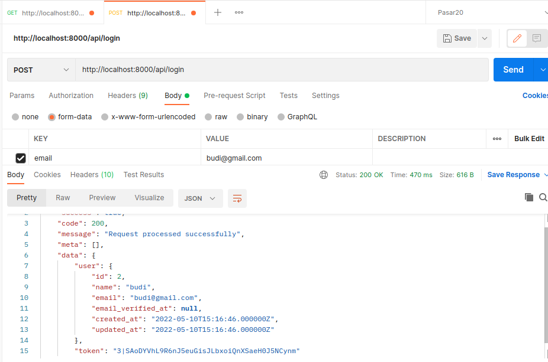
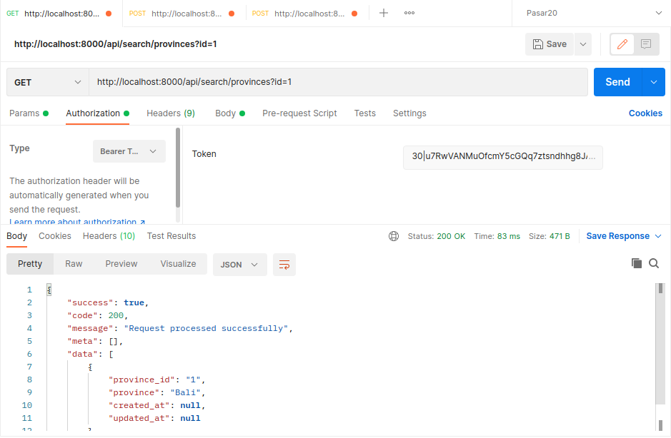
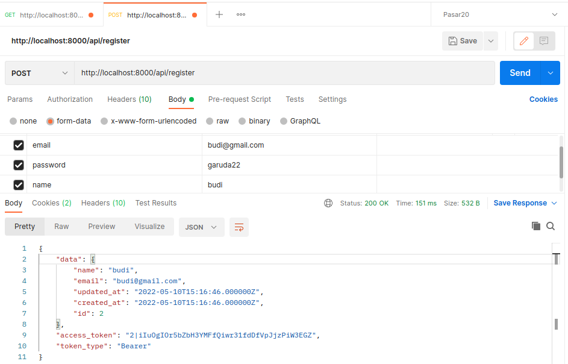
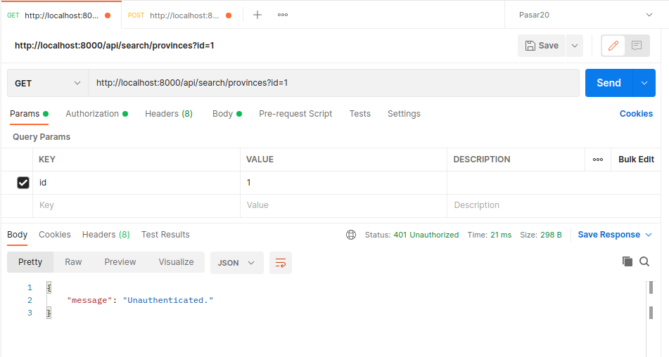

<h2>Branch With Credential</h2>

<h3>Akses endpoint menggunakan user, password, dan token</h3>

#### Tahap Install
1. Pastikan program sudah berjalan lancar pada branch main
2. `$ composer install`
4. `$ php artisan migrate`
5. `$ php artisan serve`

<h2>Ubah sumber data pencarian</h2>
    Sumber data pencarian data diubah melalui file .env pada bagian RAJAONGKIR_CACHE
    untuk mengambil dari Raja Ongkir API silahkan isi dengan null, apabila ingin mengambil data
    dari database isi dengan database

#### Register User dan Login

Buka Postman, masukkan url/endpoint

    [POST] http://localhost:8000/api/register

    Parameter : 
    name
    email
    password

    Login

    [POST] http://localhost:8000/api/login
    
    Parameter : 
    email
    password

#### Akses Data

Buka Postman, masukkan url/endpoint

    [GET] http://localhost:8000/api/search/provinces?id={city_id}
    
    Headers:
    Accept  : application/json

    Authorization
    Bearer Token : dari response api login
    

Access Data With Auth Token

<!--  -->

Guest Cannot Access Without Auth

