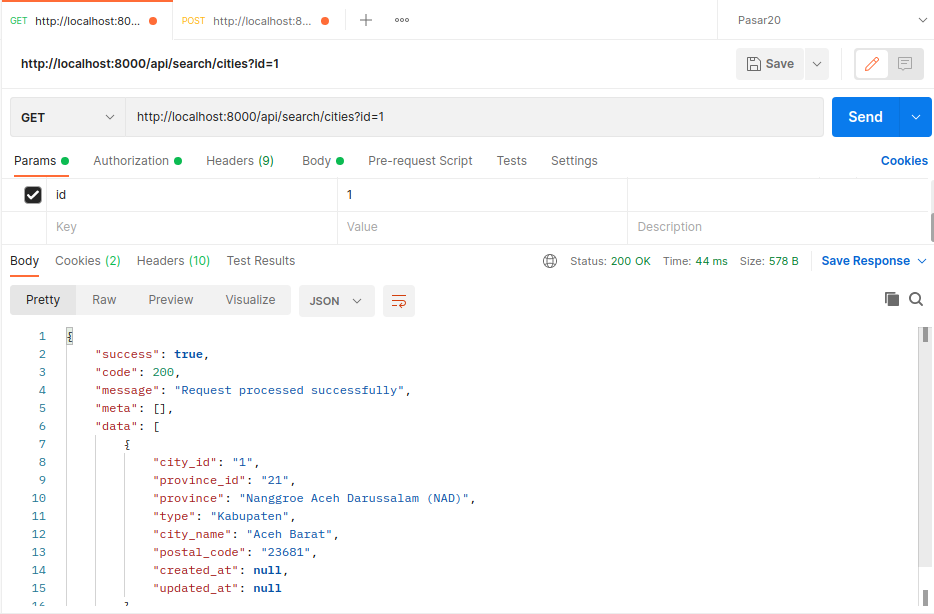
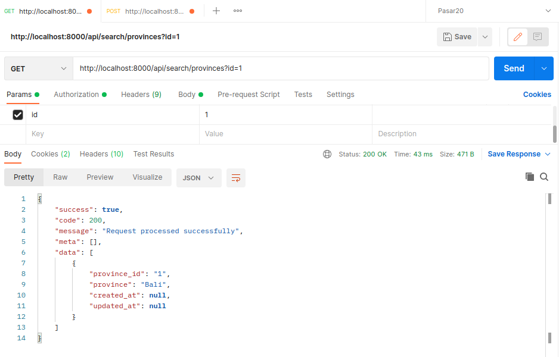

# Cek Ongkir
Cek ongkir dengan Laravel 8.x dan API Rajaongkir
#### Spesifikasi minimum server
1. PHP >= 7.3 (dan memenuhi [server requirement Laravel 8.x](https://laravel.com/docs/8.x/deployment#server-requirements)),

#### Tahap Install
1. Clone Repo, pada terminal : `git clone https://github.com/slametriky/cek_ongkir.git`
2. `$ cd cek-ongkir`
3. `$ composer install`
4. `$ cp .env.example .env`
5. `$ php artisan key:generate`
5. `$ php artisan migrate`
6. `$ php artisan serve`

<h2>Caching</h2>

<h3>Caching City</h3>

Open console/cmd and run

    php artisan raja-ongkir:cache-city

<h3>Caching Province</h3>

Open console/cmd and run

    php artisan raja-ongkir:cache-prov

#### Cara Akses

Buka Postman, masukkan url/endpoint

    http://localhost:8000/api/search/provinces?id={city_id}

    http://localhost:8000/api/search/provinces?id={province_id}

#### Screenshoot

Get City

Get Province

